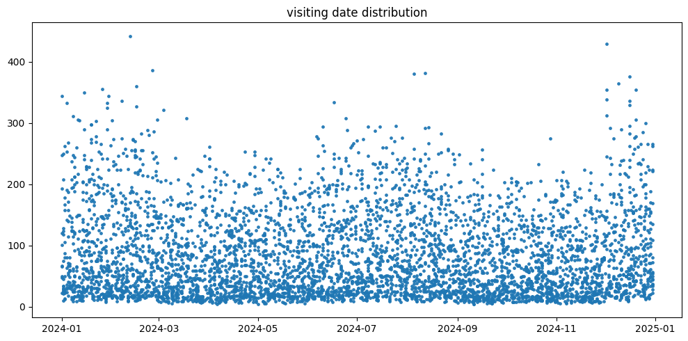
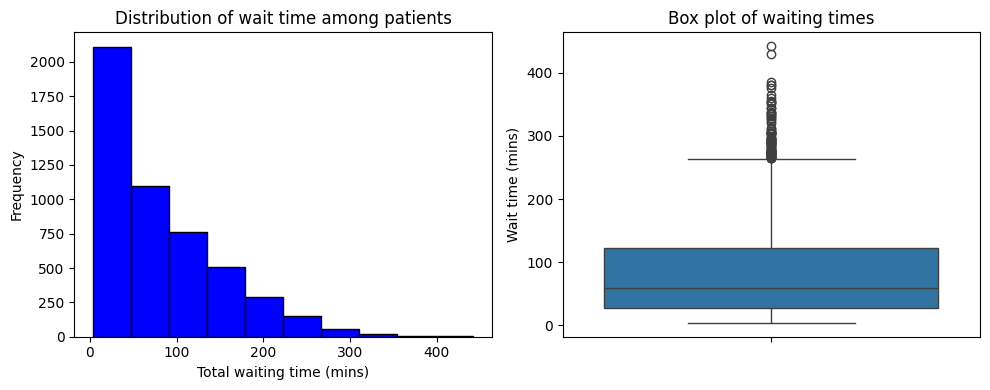
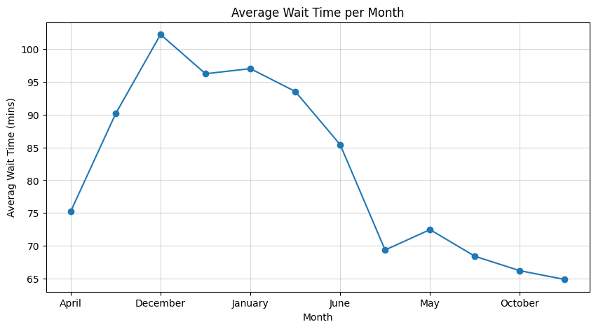
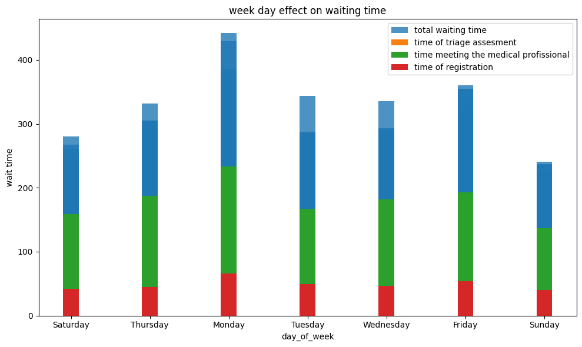

# case-study-optimaization-of-ER-waiting-time

The objective of this study is to optimise the patients' waiting times in 5 hospitals distributed through the U.S from a stimulated Kaggle dataset called E.R Wait time overview 

### The objectives of this study will be :

1- Identify the variables affecting patients' wait time and its distribution 

2- Build a descriptive model capturing the interactions between different factors affecting patients satisfaction and waiting time 

3- train a Model to predict future waiting times and crisises that can affect patients' satisfaction 

### We will be performing 5 major steps to get :

1- Explotory data analysis 

2- Regression analysis 

3- Model building 

4- Evaluation

Here we have a histogram shows the distribution of waiting time over the year:

The frequency of wait time make us capable of easly noticing that most people wait less than 100 mins (~ 81 mins):

### EXAMPLES OF KEY RELATIONSHIPS 

1- Also here we see a clear effect by month. we recognise a great increasement over Christmas and Easter holidays:

2- We can clearly see the great effect of and weekends genrally on high wait time:

3- We can can distinguising the relations, starting with correlation matrix:

