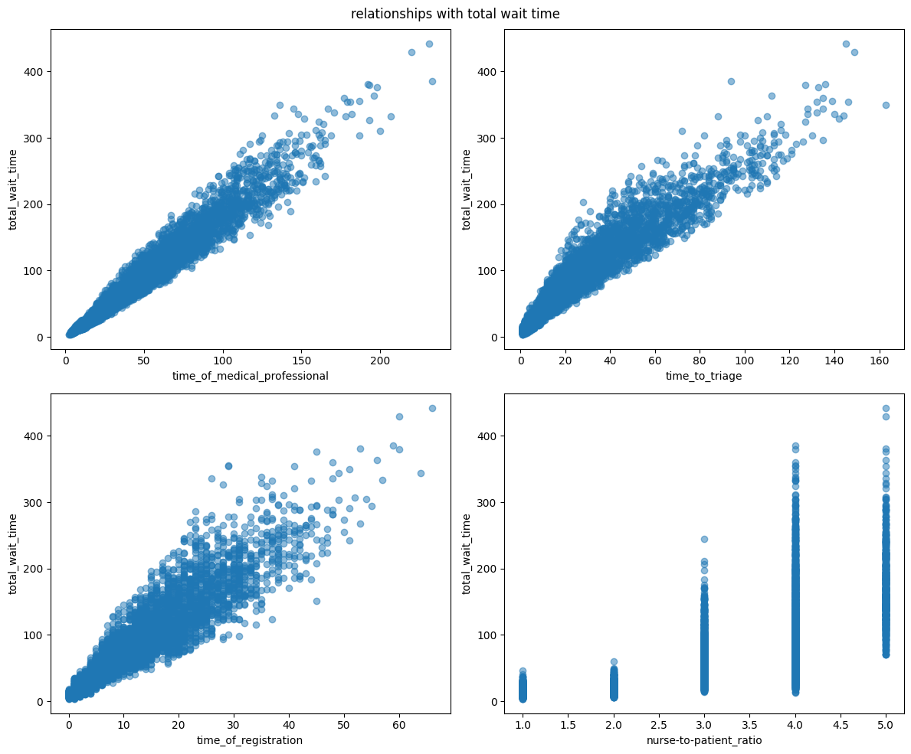

# case-study-optimaization-of-ER-waiting-time

The objective of this study is to optimise the patients' waiting times in 5 hospitals distributed through the U.S from a stimulated Kaggle dataset called E.R Wait time overview 

### The objectives of this study will be :

1- Identify the variables affecting patients' wait time and its distribution 

2- Estimate a descriptive formula that represents the interference of the various variables affecting the waiting time

3- train a Model to predict future waiting times and crisises that can affect patients' satisfaction 

### We will be performing 5 major steps to get :

1- Explotory data analysis 

2- Regression analysis 

3- Model building 

4- Evaluation

by doing the EDA we will be allowed to take a close look at the data and measure relationships between variables affecting the waiting time and patient satisfaction in the hospitals 

Here we have a histogram shows the distribution of waiting time:

here's some examples of key the insights 

we can see by the graph down here the relationship between date and waiting times 

Also here we can see the frequency of visits per week day

Here we see the total waiting time per month 

The most visited Hours during the day and variance months 

