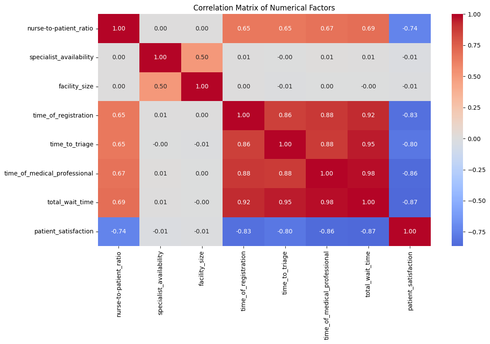

# case-study-optimaization-of-ER-waiting-time

The objective of this study is to optimise the patients' waiting times in 5 hospitals distributed through the U.S from a stimulated Kaggle dataset called E.R Wait time overview 

### The objectives of this study will be :

1- Identify the variables affecting patients' wait time and its distribution 

2- Estimate a descriptive formula that represents the interference of the various variables affecting the waiting time

3- train a Model to predict future waiting times and crisises that can affect patients' satisfaction 

### We will be performing 5 major steps to get :

1- Explotory data analysis 

2- Regression analysis 

3- Model building 

4- Evaluation

by doing the EDA we will be allowed to take a close look at the data and measure relationships between variables affecting the waiting time and patient satisfaction in the hospitals 

Here we have a histogram shows the distribution of waiting time over the year:

We also see the frequency of wait times. We can easly notice that most people wait less than 100 mins (~ about 81 mins):

### Here's some examples of key the insights 

1- Here we have the average waiting time per different hours of the day

2- Also here we see a clear effect by month. we recognise a reasonable increasement over Christmas and Easter holidays 

3- We can clearly see the great effect of monday (and weekends genrally) on high wait time:

We can see by the graph down here the relationship between week day over componantes of the overall waiting times 

#### We can can now start to have fun distinguising the strange relations, starting with my favorite (correlation matrix)

WE clearly see the red danger :) 

So we want to dive deep and explore our data in depth by the most effective way to do so, using visuals! 
Seeing this great viz may make U feel DIZY abit:

### BY NOW WE CAN START OUR ANALYSIS
##### STARTING WITH BUILDING AN OLS!!

The most visited Hours during the day and variance months 

